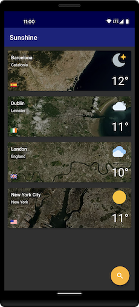
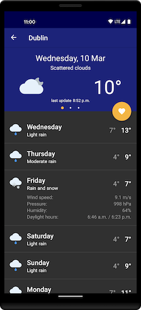

Sunshine
=========================

A simple Android weather app, providing the ability to search for and view the weather forecast for locations around the world.

Goals
------------
Although this weather app is quite a simple use case, the primary aims for the project:
* Kotlin - learn and get familiar with the language by building a project 100% in Kotlin
* Architecture - experiment with Google's [guide to app architecture][0] and apply a number of concepts and components from [Android Jetpack][1]
* Testing - aim for a high test coverage ability achieved through the architecture
* Template - potential starting point for future projects to build on the foundations

Screenshots
------------

API's
------------
* [OpenWeatherMap][2] - Provides the latest weather information
* [BigDataCloud][3] - Reverse geocode service for improved location details
* [MapBox][4] - Load static map images for any location
* [CountryFlags][5] - Load flag icons for any country

Libraries
------------
* Jetpack
    * [Android KTX][6] - set of Kotlin extensions for cleaner code
    * [Data Binding][7] - bind observable data to UI elements
    * [Room][8] - SQLite abstraction layer for caching weather data
    * [LiveData][9] - data objects that notify observers when the database changes
    * [Navigation][10] - handles in-app navigation
    * [ViewModel][11] - store UI-related data that isn't destroyed on app rotations
    * [WorkManager][12] - schedules periodic background weather updates
    * [DataStore][13] - stores key/value app preferences
    * [Hilt][14] - dependency injection
* Third Party
    * [Kotlin Coroutines][15] - simplify code that executes asynchronously
    * [Retrofit][16] - REST client
    * [Glide][17] - remote image loading & caching
    * [Moshi][18] - JSON serialization library
    * [TapTargetView][19] - feature-discovery UI prompt for first time users
    * [Timber][20] - logging

Architecture
------------
The project architecture follows the principles outlined in the official guide to app architecture. Each core component and how they interact can be visualised in the graph below:

Components can only communicate with other components one level directly below. Allowing for better modularisation and test coverage since components can be easily swapped out or mocked in test conditions.

This architecture should allow for easier development maintenance and extensibility but also provides for a better user experience. ViewModels with LiveData means handling screen rotations are now trivial and with the backing of the Room database, data access is fast and always available even when offline.

Future Work
------------
* Jetpack Compose
* Kotlin Multiplatform Mobile
* Higher test coverage
* CI pipeline through GitHub Actions

[0]: https://developer.android.com/jetpack/docs/guide
[1]: https://developer.android.com/jetpack/

[2]: https://openweathermap.org/api
[3]: https://www.bigdatacloud.com/geocoding-apis
[4]: https://www.mapbox.com/static-maps
[5]: https://www.countryflags.io/

[6]: https://developer.android.com/kotlin/ktx
[7]: https://developer.android.com/topic/libraries/data-binding/
[8]: https://developer.android.com/training/data-storage/room/
[9]: https://developer.android.com/topic/libraries/architecture/livedata
[10]: https://developer.android.com/guide/navigation/
[11]: https://developer.android.com/topic/libraries/architecture/viewmodel
[12]: https://developer.android.com/topic/libraries/architecture/workmanager
[13]: https://developer.android.com/topic/libraries/architecture/datastore
[14]: https://developer.android.com/training/dependency-injection/hilt-android

[15]: https://developer.android.com/kotlin/coroutines
[16]: https://square.github.io/retrofit/
[17]: https://bumptech.github.io/glide/
[18]: https://github.com/square/moshi
[19]: https://github.com/KeepSafe/TapTargetView
[20]: https://github.com/JakeWharton/timber